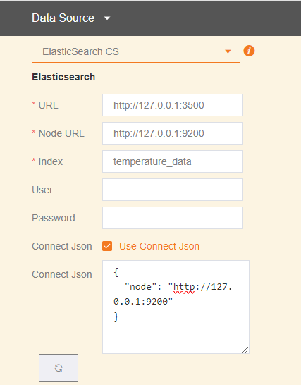
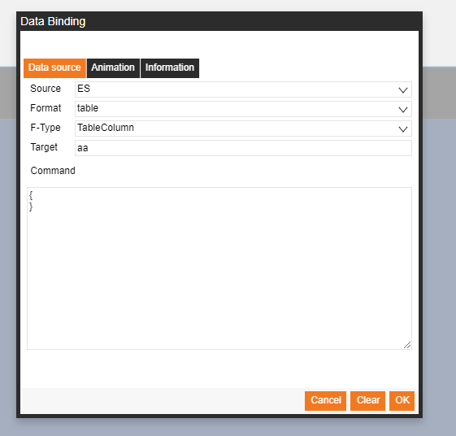

# Saas-Composer-Elasticsearch-plugin (Not fully implemented)

[About Elasticsearch client](https://www.elastic.co/guide/en/elasticsearch/client/javascript-api/current/introduction.html)

To install different version of the client, run the following command:

        npm install <alias>@npm:@elastic/elasticsearch@<version>

For example, if you need to install 7.x and 6.x, run the following commands:

        npm install es6@npm:@elastic/elasticsearch@6
        npm install es7@npm:@elastic/elasticsearch@7

In this dependencies is version 8.

## config data source  

  

If checked `connect json` will use the `connect json` option to  connect elasticsearch server.  

[Elasticsearch client basic-config](https://www.elastic.co/guide/en/elasticsearch/client/javascript-api/current/basic-config.html)  

## config query data    

    

set query conditin.  

[Elasticsearch client search query condition](https://www.elastic.co/guide/en/elasticsearch/client/javascript-api/current/search_examples.html)  